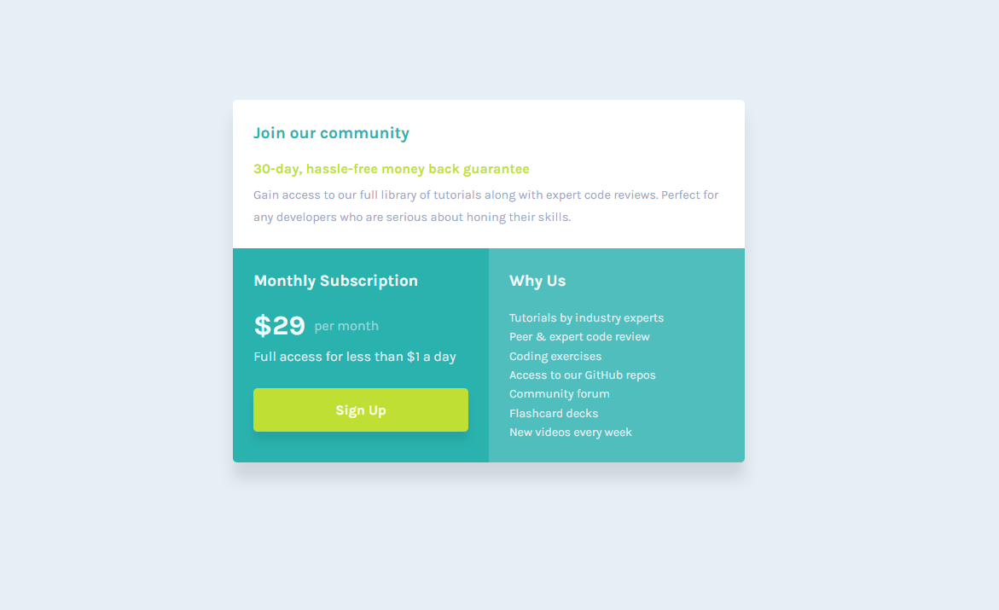

  

  <h1 align="center">Single Price Grid Component Solution</h1>
  

    <a href=https://www.frontendmentor.io/solutions/single-price-grid-component-using-css-gridflex-Jv-us20wYJ><strong>Frontend Mentor Challenge</strong></a>
     
     
    <a href="https://steady-ganache-a5e695.netlify.app/">View Demo</a>
    ·
    <a href="https://www.frontendmentor.io/solutions/single-price-grid-component-using-css-gridflex-Jv-us20wYJ" target="_blank">Leave a comment</a>
  

<!-- Badges -->

  <!-- Profile -->
  
  <!-- Status -->
    

#

This is a solution to the [Single Price Grid Component challenge on Frontend Mentor](https://www.frontendmentor.io/challenges/single-price-grid-component-5ce41129d0ff452fec5abbbc). Frontend Mentor challenges help you improve your coding skills by building realistic projects.

<h2 align="center">Links</h2>

- Solution URL: [https://www.frontendmentor.io/solutions/single-price-grid-component-using-css-gridflex-Jv-us20wYJ](https://www.frontendmentor.io/solutions/single-price-grid-component-using-css-gridflex-Jv-us20wYJ)
- Live Site URL: [https://steady-ganache-a5e695.netlify.app/](https://steady-ganache-a5e695.netlify.app/)

 

## Table of contents

- [Overview](#overview)
  - [The challenge](#the-challenge)
- [My process](#my-process)
  - [Built with](#built-with)
- [Author](#author)

## Overview

### The challenge

Users should be able to:

- View the optimal layout depending on their device's screen size
- See hover states for interactive elements

## My process

I will start with the style-guide.md file. Then I will try to gauge what fonts were used in which areas awhile making my --custom properties.

The one issue I had with this project was the main container. As the container shrinks to 320px width, the third section would disappear and even after modifying the margin and line-height for everything else, nothing really worked. I had an issue with the main container causing a vertical scroll effect after it shrunk to a certain width and I did not really know how to stop that issue. I had to change the margin for the main container and other elements to finally stop it but I was 50/50 on my solution. If anybody has suggestions what I was failing to see, it would be very helpful!

This also gave me more grid practice as I did not want to use flex for much except the price span. :)

### Built with

<!-- Badges -->

- Semantic HTML5 markup
- Pure CSS3

## Author

- Frontend Mentor - [@YorkieLT](https://www.frontendmentor.io/profile/YorkieLT)`
